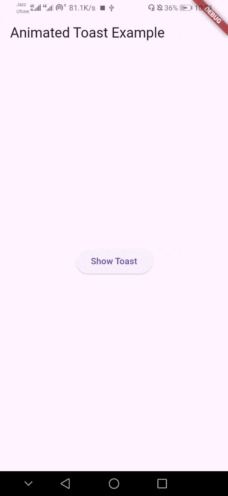

# flutter_animated_toast

A Flutter package to display animated toast messages.



## Features
- Beautiful animated toast
- Easy to use
- Lightweight & customizable
- Optional duration parameter

## Installation

Add this to your `pubspec.yaml`:

```yaml
dependencies:
  flutter_animated_toast: ^0.0.3
```

## Usage

### Basic Usage

```dart
FlutterAnimatedToast.show(
  context,
  message: "Hello!",
);
```

### With Optional Duration

(Default duration = **2 seconds**)

```dart
FlutterAnimatedToast.show(
  context,
  message: "Hello!",
  duration: const Duration(seconds: 3),
);
```

## Example

A complete working example is available inside the `example` folder.

## Support Me ❤️

If you like this package and want to support future updates, follow me on Instagram:


## License

This project is licensed under the **MIT License**.
