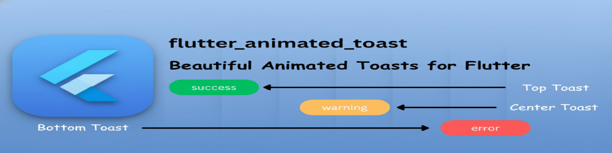
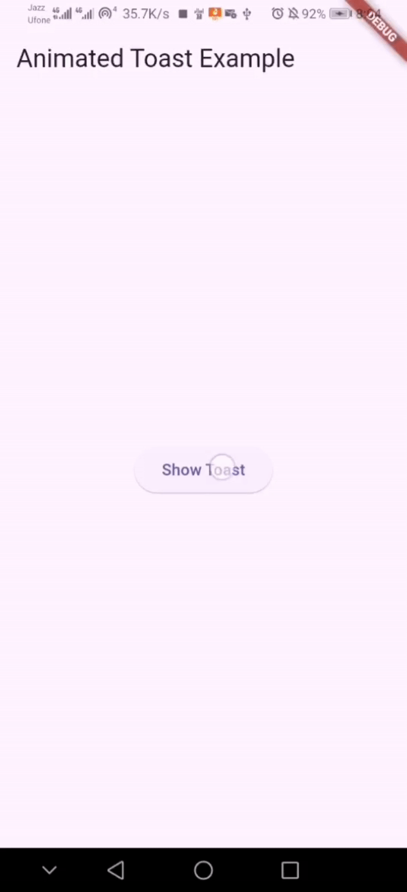
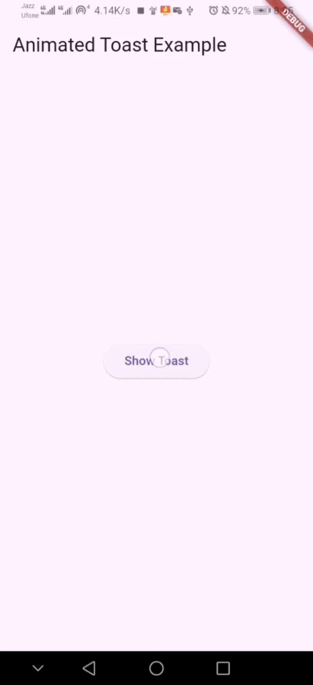
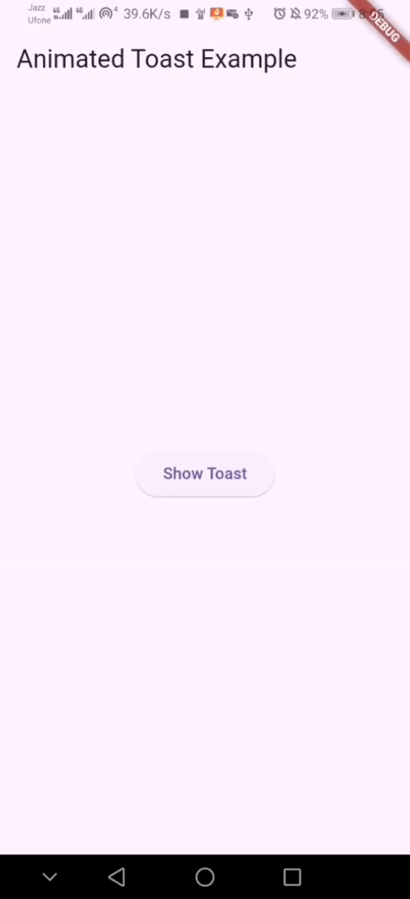

# flutter_animated_toast



A lightweight, customizable, and beautifully animated toast widget for Flutter using `OverlayEntry` with smooth slide + fade animations.


---

## ✨ Features

- Smooth slide + fade animations  
- Highly customizable (icons, heading, colors, padding, radius)  
- Supports top, center, and bottom positions  
- Optional duration parameter  
- Lightweight & easy to integrate  
- Works on all Flutter platforms  

---

## 📦 Installation

Add this to your `pubspec.yaml`:

```yaml
dependencies:
  flutter_animated_toast: ^0.0.3
````

Run:

```
flutter pub get
```

---

## 🚀 Usage

### **Basic Toast**

```dart
FlutterAnimatedToast.show(
  context,
  message: "Hello!",
);
```

---

### **Toast With Custom Duration**

(Default = **2 seconds**)

```dart
FlutterAnimatedToast.show(
  context,
  message: "Hello!",
  duration: const Duration(seconds: 3),
);
```

---

## 🎨 Custom Toast (Icon, Colors, Radius)

```dart
FlutterAnimatedToast.show(
  context,
  message: "Success!",
  icon: Icon(Icons.check_circle_outline, color: Colors.white, size: 16.0),
  backgroundColor: Colors.green,
  borderRadius: 12,
  duration: const Duration(seconds: 3),
);
```

---

## 📍 Toast Positions

### **Top Toast**



```dart
FlutterAnimatedToast.show(
  context,
  message: "This is top toast",
  position: ToastPosition.top,
  context,
);
```

---

### **Center Toast**



```dart
FlutterAnimatedToast.show(
  context,
  message: "This is center toast",
  position: ToastPosition.center,
);
```

---

### **Bottom Toast**



```dart
FlutterAnimatedToast.show(
  context,
  message: "This is bottom toast",
  position: ToastPosition.bottom,
);
```

---

## 📁 Example

A complete working example is available inside the `example` folder.

---

## ❤️ Support Me

If you like this package and want to support future updates, follow me on Instagram:

👉 **@zqflutter_dev**
[https://www.instagram.com/zqflutter_dev/](https://www.instagram.com/zqflutter_dev/)

---

## 📄 License

This project is licensed under the **MIT License**.
